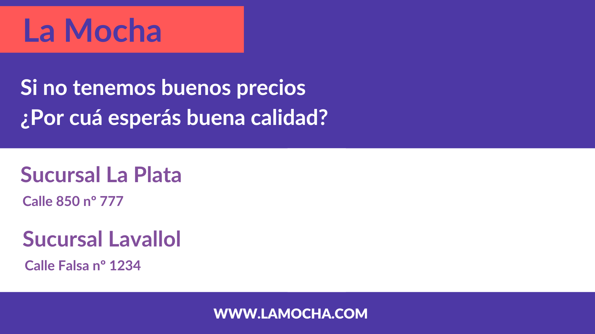

La entrega del examen se hará por este medio: tendrás que confeccionar el código adecuado para realizar cada actividad, generar los archivos correspondientes en el caso deser necesario y pushearlos a este repo que se te generó automáticamente.

Las devoluciones de este examen se harán por GitHub Classroom, por medio de Issues y comentarios. Debés hacer un commit cada 5 min, de lo contrario tu entrega no será considerada válida. Todos los ejercicios deben ser resueltos utilizando los contenidos vistos en clase.

### Consigna n°1

Dado el siguiente enlace "https://ponyweb.ml/v1/character/all", realizar las siguientes actividades adjuntando los archivos resultantes y el código utilizado para la realización de cada paso:

a) ¿Cuál es el dominio al que estamos consultando?

b) ¿Qué status_code devuelve el pedido a dicha URL? ¿Y qué content_type?

c) Averigüá cuántos Ponies almacena la API

d) ¿Cómo esperás que sea la URL para obtener la información del Pony 44? ¿y cómo será la url para obtener todas las canciones (song)? Probalas y comentá que otras URL se te ocurrirían para reemplazar las que existen

e) Generar un script que guarde los datos correspondientes al Pony 44 en un archivo cuyo nombre sea el nombre del poni correspondiente y extensión ".txt"

### Consigna n°2

Dado el siguiente [dataset](https://github.com/FundamentosInformaticaUCEMA/Simulacro_P2_2022/blob/master/data.csv), resolvé los siguiente incisos:

a) Cargá los datos en un data frame, inspeccionalo y caracterizalo.

b) Limpiá el data frame de las 3 posibles anomalías que pueda contener. Luego, de ser necesario, normalizá las columnas que hagan falta.

c) La cadena de supermercados "La Mocha" está evaluando crear tarjetas con beneficios para las personas que compran en ella, por lo que se disponen a agrupar a estas personas dependiendo de el ingreso que tienen y la cantidad que gastan, a fin de generar dos o tres grupos a los cuales se les va a asignar una tarjeta con ciertos beneficios.
Detallá los pasos a seguir para que, a partir del data frame curado (sin las anomalías) se obtengan los grupos requeridos y cómo evalúa si lo realizado es correcto. AVISO: para este punto no hay que ejecutar código, sino detallar los pasos.

d) Dados los gráficos ([Codo1](https://github.com/FundamentosInformaticaUCEMA/Simulacro_P2_2022/blob/master/Codo1.png) y [Silhouette1](https://github.com/FundamentosInformaticaUCEMA/Simulacro_P2_2022/blob/master/Silhouette1.png) por un lado, y [Codo2](https://github.com/FundamentosInformaticaUCEMA/Simulacro_P2_2022/blob/master/Codo2.png) y [Silhouette2](https://github.com/FundamentosInformaticaUCEMA/Simulacro_P2_2022/blob/master/Silhouette2.png) por otro), analizar y evaluar si el proceso de clustering fue correcto en cada caso. Explicitar tanto lo que está bien como lo que considerás que está mal.

### Consigna n°3

En "La Mocha" están buscando desarrolladores web para crear su página y vos sos candidat@; para postular te piden demostrar algo de conocimiento sobre HTML y CSS resolviendo los siguientes puntos:

a) Crea una página HTML con el sigueinte estilo y contenido:

b) ¿Qué etiquetas de HTML conocés? ¿Para qué sirven?